# 项目文档Readme

## 一、前端代码评审模板
### 代码评审-应用名  
讲解人:

评审人:

评审日期:

评审内容（需求/缺陷）：  

评审结果（是否通过）：

检查项 | 是否符合?
--------- | -------------
***编码习惯：（框架使用与基本使用）**|
css、js、image等静态文件应该放在约定的目录里面|
在页面中尽量避免写入行内样式，即style=“”。|
js语法中语句结束采用分号结尾，变量声明后必须用分号结尾。| 
引号规则：一句代码中只使用一种引号则双引号优先，否则同意最外层使用单引号。|
变量命名：变量采用驼峰式命名且首字母小写（除了对象的属性以外），定义后没有被使用的变量要删除。|
函数规则：无论是函数声明还是函数表达式，“(”前不要空格，但‘’{‘’前一定要有空格。函数调用括号前不需要空格，立即执行函数外必须包一层括号。|
数组、对象的规则：两者最后均不要有多余的逗号；对象以缩进的格式书写，切忌书写在同一行；对象属性名不需要加引号。|
在同一个函数内部中，局部变量的声明必须定义在顶端。|
除了三目运算符外，其他的（if、else等）禁止简写。如果if (true) alert("alert")。|
在需要以为{ }闭合的代码段前增加换行，如for、if。|
不允许把多个短语句写在一行中，即一行只写一行数据。|
函数中传入的参数必须具有有效性，对特殊的入参必须进行说明。|
尽量减少循环嵌套层次，尽量避免大于三层的循环。|
***业务实现：（设计思路与业务逻辑）**|
如果类似的逻辑被使用了多次，应该把它写成一个函数，然后再多处调用。|
如果类似的逻辑被多个模块使用且没有复杂的关联性，应该把它写入静态js文件，然后在使用到的模块中进行引用后再使用。|
强调代码的单元测试|
任何新加的代码不应该破坏已有的代码。|
安全：（系统安全性）|
任何代码都不能执行用户的输入，除非转义过了。这个常常包含 JavaScript 的 eval 函数|
对于那些在短时间内提交非常多请求的方法，可以采用防抖或者节流来控制请求次数，或者采用loading来阻止用户多次点击。|
发生故障时，尽量少的暴露问题所在，只向用户返回一般的信息，比如登陆失败不应区分具体失败原因（用户名不存在、密码错误、密码已过期等），应采用统一的失败提示（错误的用户名或密码）。|
`性能：（系统运行消耗和可扩展性）`|
***性能：（系统运行消耗和可扩展性）**|
所有不需要的变量应该及时的删去；尽量减少闭包的使用；如果在代码中使用了闭包，则必须在退出函数之前，将不使用的局部变量全部删除，或者将变量赋值为null。|
尽量使用字体图标或SVG图标来代替传统的png图。因为字体图标或者SVG是矢量图，是由代码编写出来的，放大后不会变形，而且渲染速度快。|
样式中给图片设置尺寸。如果图片不设置尺寸，首次载入时，占据空间会从0到完全出现，上下左右都可能位移，发生回流。|
注意控制Cookie大小和污染，因为Cookie是本地的磁盘文件，每次浏览器都会去读取相应的Cookie，所以建议去除不必要的Coockie，使Coockie体积尽量小以减少对用户响应的影响。|
***注释：（关注点-代码可读性注释清晰完善）**|
Js单行注释：在代码上面注释，必须独占一行。// 后跟一个空格，缩进与下一行被注释说明的代码一致。|
Js后缀注释：在一段语句后面后缀进行注释， // 前后都跟一个空格，用于对某个语句的说明。|
函数注释： 在函数的上面注释，注释内容：描述函数的功能、参数的含义等信息，  /**  * @name 函数描述  * @param {*} data  */|
在有处理逻辑的代码中，代码有效注释量必须在20％以上。|
文件注释：文件注释（包括作者, 依赖关系和兼容性信息等）写在文件头部。|
注释的内容要清楚、明了，含义准确，防止注释二义性。说明：错误的注释不但无益反而有害。|
 对变量的定义和分支语句（条件分支、循环语句等）必须编写注释。|
***新技术**|
代码使用新技术是否有效，是否最优|

## 二、单元测试报告模板
### 营销系统单元测试报告
#### 目录
##### 1、	编写目的---------------------------------------------------------
##### 2、	软件单元描述-----------------------------------------------------
##### 3、	单元结构---------------------------------------------------------
##### 4、	测试过程---------------------------------------------------------
##### 5、	测试结果---------------------------------------------------------
##### &nbsp;&nbsp; 5.1 代码执行覆盖率------------------------------------------------  
  ##### &nbsp;&nbsp; 5.2 测试用例统计--------------------------------------------------
  ##### &nbsp;&nbsp; 5.3 测试单元产品--------------------------------------------------

#### 1.	编写目的
编写本单元测试报告的目的在于：   
1）、对单元测试结果进行整理汇总，形成正式的测试文档   
2）、为软件单元的评审验收提供依据   
3）、纳入软件产品配置库   
#### 2.	软件单元描述
简单描述被测试单元或之前相关单元的产品项目名称、所属子系统、单元要完成的功能、需求和设计要求等。  

被测试单元 | 所属子系统 | 单元设计 | 单元测试 |
--------- | ------------- | --------- | -------------
accept | 营销服务 | 模拟核心同步MQ消息 | 请求发奖接口
| | | |
| | | |
| | | |
#### 3.	测试结果
#### 3.1	代码执行覆盖率
执行覆盖率结果图
#### 3.2	测试用例统计
测试用例执行结果统计表
测试项 | 测试用例号 | 测试用例 | 用例描述 | 是否符合预期结果
--------- | ------------- | --------- | ------------- | -------------
营销-已在线邀请活动-用有效邀请码注册-老用户中奖 | 1	| 开户奖励积分正例	| 积分发奖成功	| 符合
营销-已下线分享活动-在线邀请活动-用有效邀请码注册-老用户中奖	| 2	| 开户奖励积分正例	| 积分发奖成功	| 符合
营销-后管-中奖逻辑-创建活动-支付附加条件，卡组织为CUP QR，用户使用CUP QR支付,营销收到MQ，MQ中包含CUP QR	| 3	| 单笔支付积分奖励 | 	积分发奖成功	| 符合
营销-后管-创建活动-卡组织选择银联、上传MID文件A列一致-创建活动	| 4	| 创建支付活动 | 创建支付活动成功	| 符合
营销-后管-新建奖励名称-应用产品为存款-输入纯大写字母奖励名称-创建成功	| 5	| 创建奖励名称	| 创建成功	| 符合
营销-后管-人工发奖创建，选择独立发奖,应用产品 存款,奖励名称 存款类活动奖励名称创建成功	| 6	| 人工发奖(独立发奖)	| 创建人工发奖成功	 | 符合
营销-后管-营销码管理模块-营销码名称长度校验，营销码名称长度为20	| 7	| 创建营销码	| 创建营销码成功 | 符合
营销-后管-新建奖励名称-应用产品为存款-输入30位奖励名称-创建成功	| 8	| 创建奖励名称	| 创建奖励名称成功	| 符合
营销-后管-人工发奖创建，选择独立发奖,切换应用产品为存款，检查下拉选项	| 9	| 人工发奖检查下拉选项	| 下拉选项展示成功	| 符合
营销-后管-分享管理-关联活动ID设置选项隐藏	| 10	| 关联活动ID隐藏 | 关联活动ID隐藏	| 符合
营销-已下线分享活动-用有效邀请码注册-查看分享关系	| 11	| 查看分享关系	| 查看分享关系	| 符合
#### 3.3	测试单元产品

分享在线邀请活动积分奖励正例
测试用例号 | 测试产出
--------- | -------------
1	| 运行结果截图
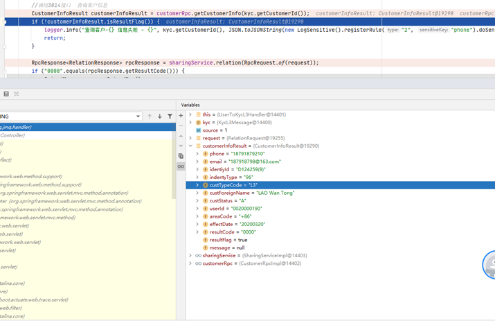
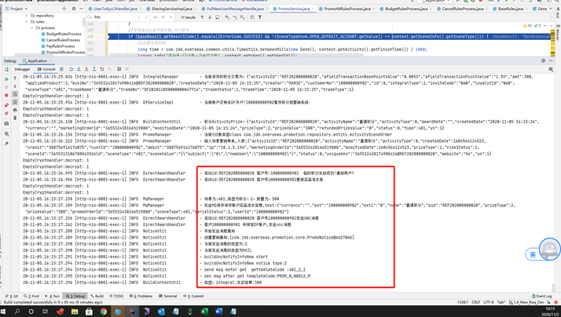

分享下线邀请活动积分奖励正例
测试用例号 | 测试产出
--------- | -------------
2	| 运行结果截图
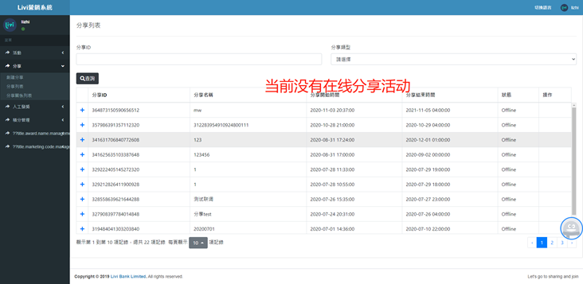
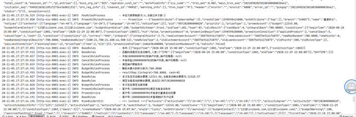
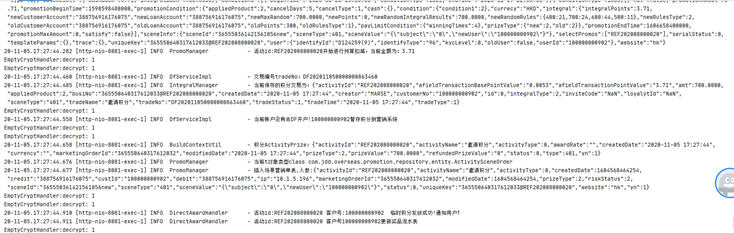
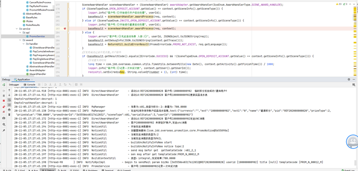

单笔支付积分奖励
测试用例号 | 测试产出
--------- | -------------
3	| 运行结果截图
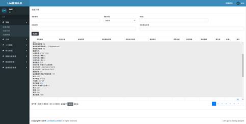
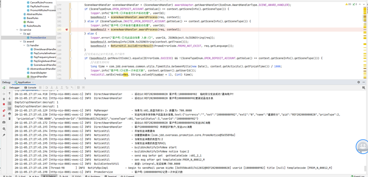
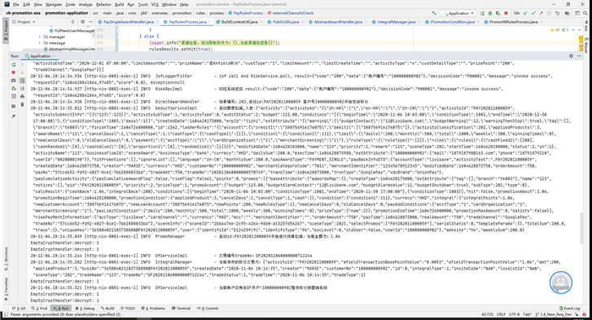
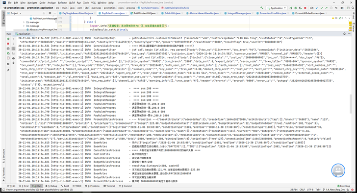
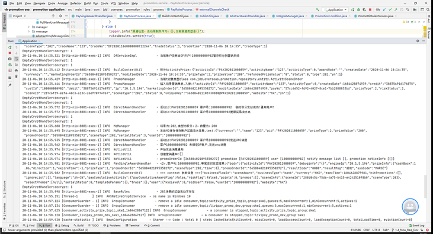
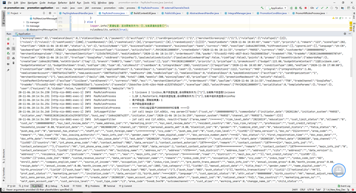

创建支付活动成功
测试用例号 | 测试产出
--------- | -------------
4	| 运行结果截图
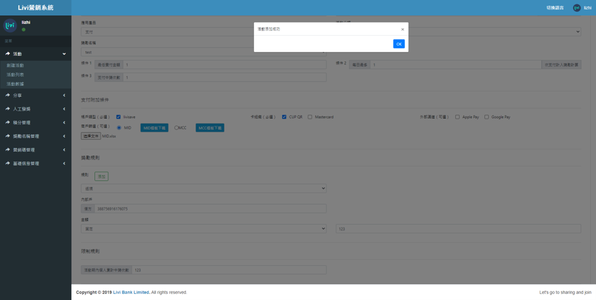

创建奖励名称
测试用例号 | 测试产出
--------- | -------------
5	| 运行结果截图
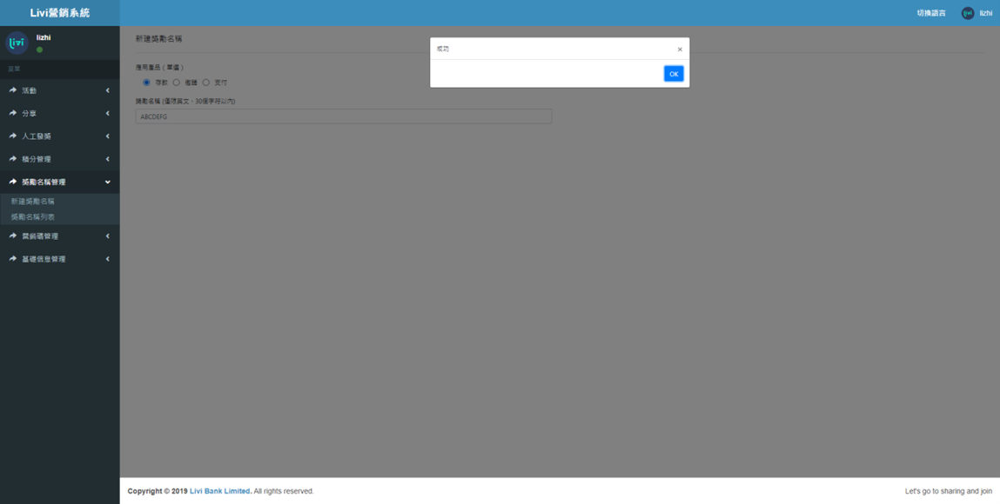

人工发奖(独立发奖)
测试用例号 | 测试产出
--------- | -------------
6	| 运行结果截图
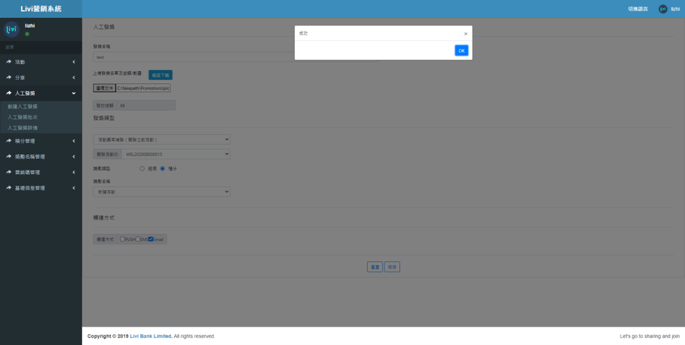

创建营销码
测试用例号 | 测试产出
--------- | -------------
7	| 运行结果截图
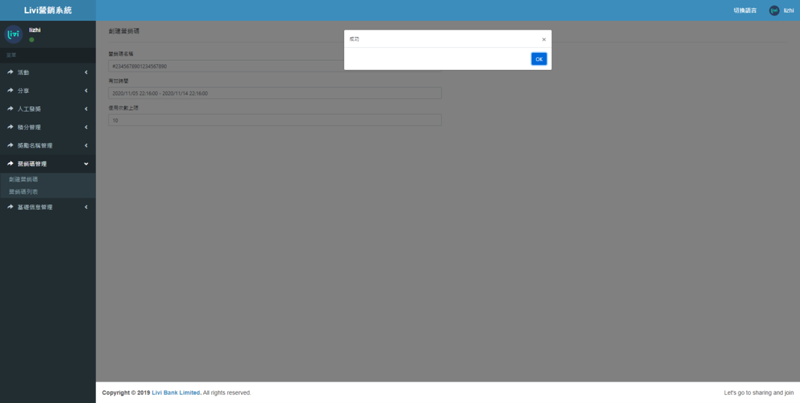
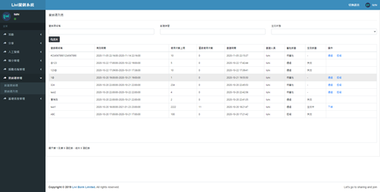

创建奖励名称
测试用例号 | 测试产出
--------- | -------------
8	| 运行结果截图
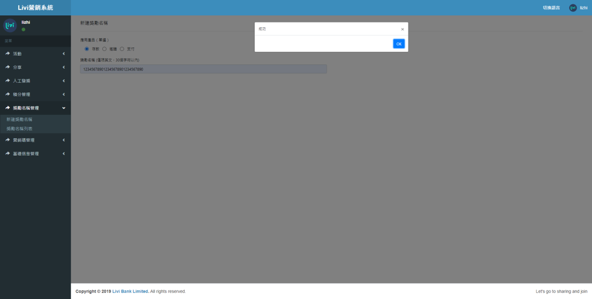

人工发奖检查下拉选项
测试用例号 | 测试产出
--------- | -------------
9	| 运行结果截图
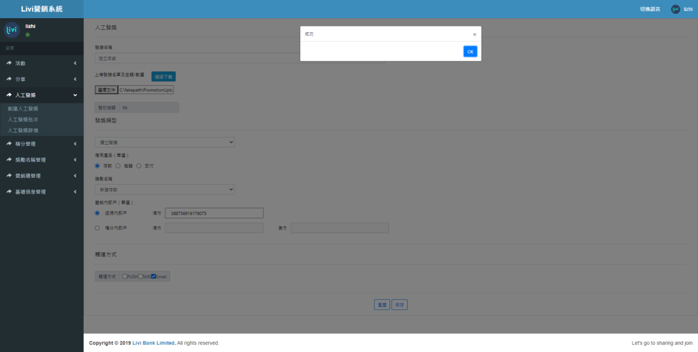
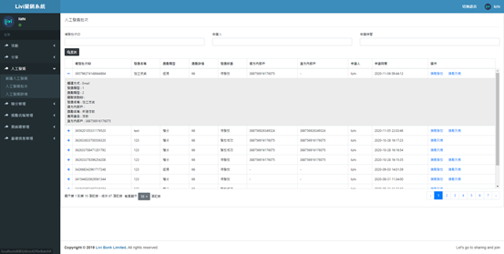

关联活动ID隐藏
测试用例号 | 测试产出
--------- | -------------
10	| 运行结果截图
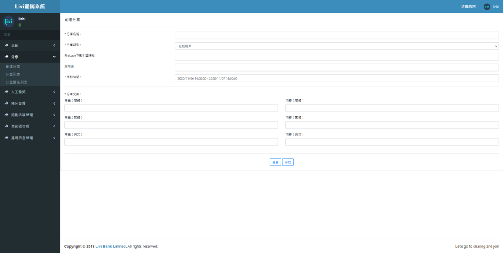

查看分享关系
测试用例号 | 测试产出
--------- | -------------
11	| 运行结果截图
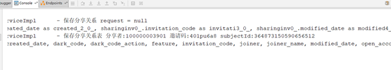
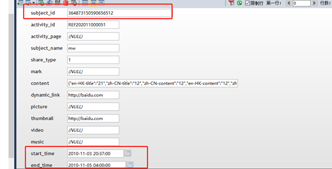
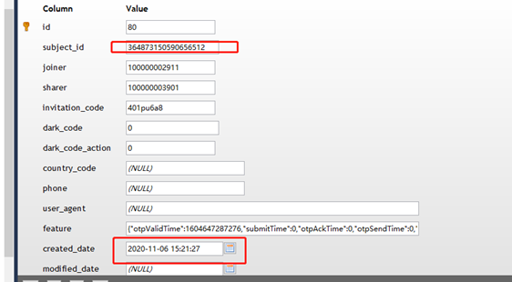

## 三、Livi研发测试提测模板和流程模板
### 提测流程图
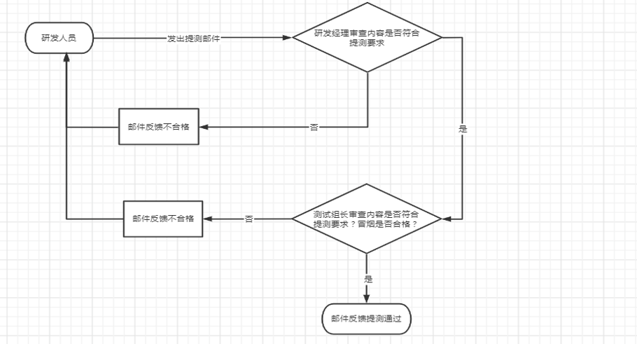
### 提测模板
统一要求: | 1. 提测的邮件发送给**所在小组组长，抄送 liviszteamleader@jd.com  vb_livi_bigdata@jd.com** 以及其他所有相关的人（如项目经理，组长，产品，大数据、业务，测试等） 2. 将以下提测表格内容**直接复制在邮件里**进行填写，可以作为附件，但**一定要把表格复制到邮件里，并确保格式正确**  3. 以下填写内容中不要涉及到密码等机密信息，如果需要涉及到密码，可用**代替  4. 各研发经理对提测内容进行检查，同时和项目经理以及测试保持同步，对内容不符合要求的提测邮件一律退回  5. SIT测试对内容不符合要求、冒烟不通过的提测，直接退回
--------- |:-------------|
需求类型 | 如是正常按计划的排期需求，填“版本号-常规需求”，如**1.2-常规需求** 如是线上问题修复，填“**线上问题修复-对应的问题编号”如线上问题修复-IM1111** 如非以上类型，填“版本号-特殊需求”，如**1.3-特殊需求**
需求名称 | "如是需求，提供**需求ID**和名称。 如是IM，提供**IM编号**和对应的名称。 如是SIT/UAT的BUG，无需提测，走缺陷流程"
JCI应用名 | JCI应用名，APP前端提测系统名称，一个写IOS，一个写Android
提测分支 | JCI提测的分支号 **原则上一个版本内只有一个分支。例外则申请豁免。线上问题修复则联系俊博分配分支。**
提测编号 | 填写具体JCI提测编号 针对App，写 App暂未接入JCI，无提测编号
产品人员 | 提测对应的产品人员
研发人员 | 提测对应的研发人员
测试人员 | 提测对应的测试人员
是否三方确认 | 确认研发/测试/产品人员对此提测都是信息一致的
数据库变更 | "如没有则写无 如有则写上**禅道ID** ; 必须发禅道任务给环境小组"
配置参数修改 | "如没有则写无有 | 如有则写上**禅道ID** ; 必须发禅道任务给环境小组"
接口修改 | 如没有则写无，具体列出接口变更
接口文档 | 提供标准接口文档，如不涉及接口修改则可不提供
详细设计文档 | 由开发人员编写
提测细化功能点 | 如是需求，列明**所有的功能点**。 如是IM，则列明详细的**IM信息**。
影响范围评估 | **提供影响范围，如基础修改或者线上IM修复，则需提供单独的分析报告，具体模板可联系俊博。如不确定，后端系统可提供对应修改接口、名称和用途，由开发根据具体模块影响填写测试建议和关联模块注意事项等。**
上下游依赖关系 | 提供上下游依赖系统
系统联调 | 如完成，则写**系统联调已通过** 如未完成，如状态为未通过/未联调，需要提供原因，以及后续的联调计划
测试注意事项 | 如没有则写无 如有则具体列出测试注意事项
单元测试 | **需求，线上IM修复，需提供** 单独附件，提供测试报告，应包含自测用例的执行截图
静态代码扫描 | **需求，专项代码扫描的修复，需提供** 单独附件，提供代码扫描结果
代码评审 | **需求提测和IM需要代码评审** 已完成，**附上代码评审的会议既要** 未完成，需要写明原因，以及后续的计划
DRD评审结果 | **需求提测需要DRD评审** 已完成，**附上DRD评审会议既要** 未提供，需要写明原因，以及后续的计划

### 邮件回复模板
 &nbsp;| 同意，邮件回复模板 | 不同意，邮件回复模板
--------- |:--------- |:-------------|
研发经理 | 提测通过，如缺失材料则注明原因，如： 1、代码扫描报告（已提供/后补） 2、单元测试报告（已提供）  3、详细设计评审（已提供/后补） 4、代码评审报告 （已提供） | 不通过，注明原因，如： 1、代码扫描报告（缺失）  2、单元测试报告（缺失） 3、详细设计评审（缺失） 4、代码评审报告（缺失）
测试组长 | 提测符合要求且冒烟通过，如缺失材料则注明，如： 1、代码扫描报告（请后补） 2、代码评审报告 （请后补） | 不通过，注明原因，如： 1、代码扫描报告（缺失）  2、单元测试报告（缺失） 3、详细设计评审（缺失） 4、代码评审报告（缺失） 5、冒烟不通过

### 测试邮件回复
统一要求: | 1. 测试在冒烟测试通过后，需整理如下表内容的邮件全部回复。 2. 将以下提测表格内容**直接复制在邮件里**进行填写，可以作为附件，但**一定要把表格复制到邮件里，并确保格式正确** 3. 以下填写内容中不要涉及到密码等机密信息，如果需要涉及到密码，可用**代替 4. 各测试组长对内容进行检查，对不符合要求的要求其调整。质量组定期抽查
--------- |:-------------|
测试结论 | **通过、不通过  不通过的注明原因**
测试人员 | 执行冒烟用例的测试
需求名称 | 如是需求，提供需求ID和名称。 如是IM，提供IM编号和对应的名称。
需求文档 | 该需求相关文档，上传附件
测试计划 | 上传附件
冒烟测试通过的截图 | 在sit环境测试通过的截图，word附件
测试用例导图 | 提测需求相关的x-mind导图，附件
接口测试脚本 | （如不涉及接口测试可不提供）
环境清单 | 各子系统的IP地址，端口号，数据库信息和服务器日志查看的用户名、密码等，密码用**代替

## 四、代码扫描分析报告
**深圳研发中心**
**2020年12月版**
内部专用    V1.0 |
--------- |
**必须遵循：深圳研发中心各处** |
一、Cross-Site Scripting: DOM ---------------------------------------------------------	1  
├──1.1 扫描结果	--------------------------------------------------------- 1  
├──1.2 结果说明	--------------------------------------------------------- 1  
├──1.3 总体处理结果	--------------------------------------------------------- 1
├──1.4 处理方案	1
二、Header Manipulation: Cookies ---------------------------------------------------------	1  
├──2.1 扫描结果	--------------------------------------------------------- 1  
├──2.2 结果说明	---------------------------------------------------------	2  
├──2.3 总体处理结果	--------------------------------------------------------- 2  
三、Insecure Randomness	--------------------------------------------------------- 2  
├──3.1 扫描结果	--------------------------------------------------------- 2  
├──3.2 结果说明	--------------------------------------------------------- 3  
├──3.3 总体处理结果	---------------------------------------------------------	3  

### 一、 Cross-Site Scripting: DOM
#### 1.1	扫描结果
序号| 类别 | 文件地址	| Critical | High | Medium | Low | Total Issues | 处理结果
--------- | ------------- | --------- | ------------- | --------- | ------------- | --------- | ------------- | -------------
1	| Cross-Site Scripting: DOM | build/static/js/0.b89f716e.chunk.js	| 12 | 0 | 0 | 0 | 0/12	| 无需处理

#### 1.2	结果说明
代码扫描此问题是:用户输入文本，输入框中的文本恶意js导致XSS攻击，攻击者可以获得更高的特权，但不限于，作为一些微妙的cookie信息，用户信息等。在项目中用户要做输入框前后的输入约束，如:数量只能输入数字+十进制，postscript和好友注释限制规则是由一些过滤器造成的可以攻击符号如(、<、>、)、_等 

#### 1.3	总体处理结果
无需处理

#### 1.4	处理方案
维持原样

### 二、Header Manipulation: Cookies 
#### 2.1	扫描结果
序号| 类别 | 文件地址	| Critical | High | Medium | Low | Total Issues | 处理结果
--------- | ------------- | --------- | ------------- | --------- | ------------- | --------- | ------------- | -------------
1	| Header Manipulation: Cookies | build/static/js/transfer-home.7285ecf6.chunk.js	| 0 | 0/1 | 0 | 0 | 0/1	| 无需处理(webpack打包之后的文件)处理

#### 2.2	结果说明
cookie充当了浏览器与服务器之间的一种持续性链接。当cookies被盗窃,用户的个人基本信息就相当于透明一般的存在,整个项目未使用到cookies,用到是登录态, APP端会拦截h5的请求,会在请求上增加登录个人id,和登录态

#### 2.3	总体处理结果
维持原样不处理  
原因：在项目中未使用cookie，不会暴露用户安全隐私和敏感数据,不需要修改

### 三、Insecure Randomness
#### 3.1	扫描结果
序号| 类别 | 文件地址	| Critical | High | Medium | Low | Total Issues | 处理结果
--------- | ------------- | --------- | ------------- | --------- | ------------- | --------- | ------------- | -------------
1	| Insecure Randomness | build/js/jsBridge_common-1.2.1.js	| 0 | 0/1 | 0 | 0 | 0/71	| 1.无需处理(webpack打包之后的文件) 2.	项目中使用的Math.random 只作为随机数作为uuid,不影响安全
#### 3.2	结果说明
使用Math.random生成随机数当成一次性密码时,Math.random有较强的重复性.项目中使用Math.random,只作为不重复的uuid + 当前日期的时间戳,重复的可能性极低,以及我们未使用Math.random作为一次性密码,不影响项目安全.

#### 3.3	总体处理结果
维持原样

### 四、Password Management: Empty Password
#### 4.1	扫描结果
序号| 类别 | 文件地址	| Critical | High | Medium | Low | Total Issues | 处理结果
--------- | ------------- | --------- | ------------- | --------- | ------------- | --------- | ------------- | -------------
1	| Password Management: Empty Password | build/static/js/mock.f0a10a7c.chunk.js	| 0 | 0/5 | 0 | 0 | 0/5	| 1.无需处理
#### 4.2	结果说明
当登录密码以及支付密码等变量初始化为空时,恶意者当网络差时,可以直接点击登录或者支付来成功获取用户信息和一些重要物资,项目中使用密码时变量初始化都为null,不会影响项目安全.

#### 4.3	总体处理结果
维持原样