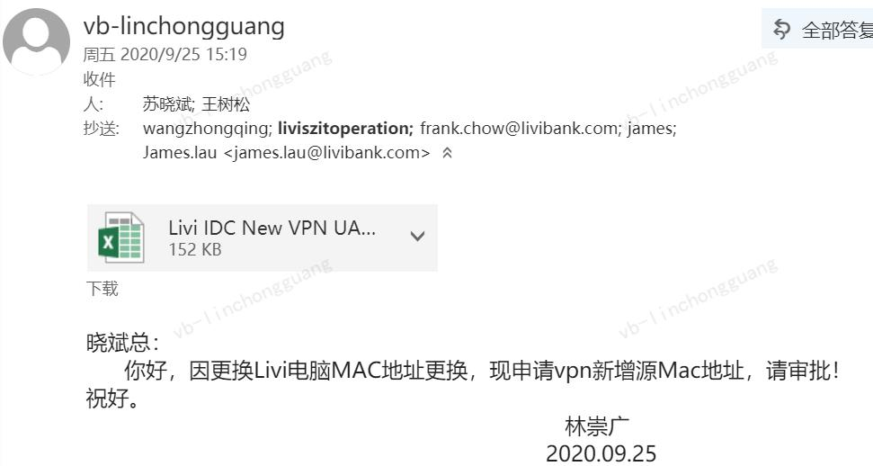
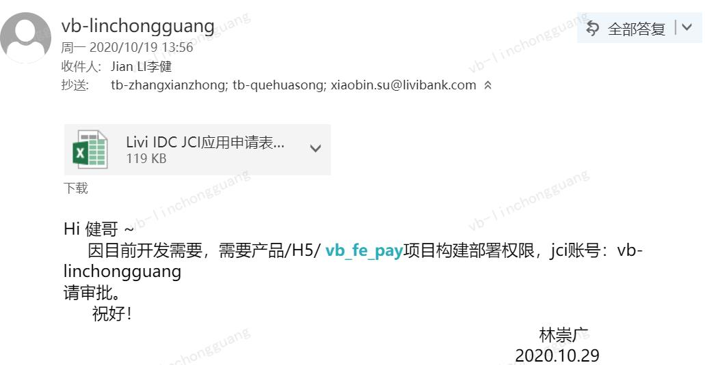

# 新人手册

## 一、新人入职准备
填写入职资料—>等待行政同事分发邮箱账号—>新VPN申请—>禅道用户申请—>申请JCI账号—>Livi-JCI应用申请
## 二、VPN/JCI 账号申请
1）vpn申请模板  

2）JCI账号申请模板  

## 三、开发环境搭建
选择产品——>选择H5——>对应的应用——>创建变更（已有变更就不需要创建）——>点击相关变更绑定分支——>选择dev环境——>构建部署仓库
## 四、仓库代码&部署权限申请
1）仓库代码  
选择代码——>选择仓库——>创建仓库

2）部署权限申请模板 
 
## 五、代码拉取&运行
git clone 仓库地址  
npm run dev