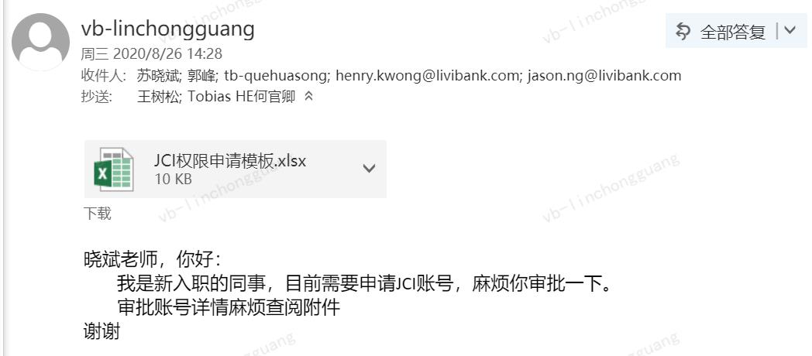
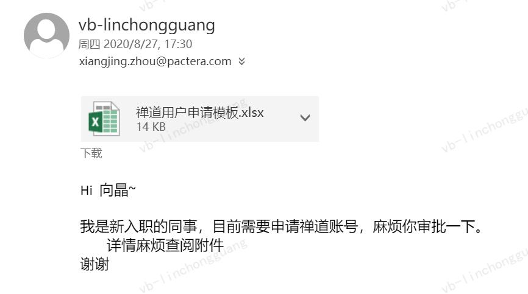

# 新人手册

## 一、新人入职准备
填写入职资料—>等待行政同事分发邮箱账号—>新VPN申请—>禅道用户申请—>申请JCI账号—>Livi-JCI应用申请

- [最新模板禅道下载地址](http://bugim.vbuat.livibank.com/zentao/doc-browse-251.html) 
## 二、VPN/JCI 账号/禅道申请
1）vpn申请模板
::: tip 提示
邮件收件人和抄送人以禅道下载的最新模板内的示例为准
:::   

2）JCI账号申请模板
::: tip 提示
邮件收件人和抄送人以禅道下载的最新模板内的示例为准
:::   

3）禅道申请模板
::: tip 提示
邮件收件人和抄送人以禅道下载的最新模板内的示例为准
:::   

## 三、开发环境搭建
选择产品—>选择H5—>对应的应用—>创建变更（已有变更就不需要创建）—>点击相关变更绑定分支—>选择dev环境—>构建部署仓库
## 四、仓库代码&部署权限申请
1）仓库代码  
选择代码—>选择仓库—>创建仓库

2）部署权限申请模板
::: tip 提示
邮件收件人和抄送人以禅道下载的最新模板内的示例为准
:::   
 
## 五、代码拉取&运行
git clone 仓库地址  
npm run dev