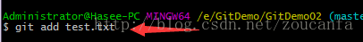

# 仓库创建规范

## 创建git仓库步骤：

### 1、首先登陆Github账号
::: tip 提示
如果没有就申请一个github账号
:::
### 2、登陆成功后

鼠标移动到头像位置，选中“Your profile”进入以下界面

### 3、然后选中

### 4、进入到

### 5、创建成功后进入到

### 6、然后在磁盘里面创建一个文件夹保存相关代码

### 7、然后打开这个文件夹，鼠标右键点击

鼠标右键点击 Git Bash Here,打开终端，输入git clone 仓库地址

::: tip 提示
注意: 仓库地址选择
:::

### 8、回车，项目拉去成功
此时你会发现你的文件夹里多了几个文件

### 9、接下来打开

### 10、进入

### 11、然后新建一个文件，随便写入一些内容测试，形如：

### 12、然后再git终端输入：cd 项目文件夹名称

### 13、回车执行，再输入：git add 新建文件夹名称

### 14、回车执行，再输入：git config –global user.name “用户设置的名称”

### 15、回车执行，再输入：git config –global user.email “用户的邮箱”

### 16、回车执行再次输入：git commit -m “描述提交的内容”

### 17、回车执行再次输入：git pull origin master

### 18、回车执行，最后输入：git push origin master

代表执行成功
::: tip 提示
注意：如果是首次输入上面一行命令会有一个github弹框，输入你的github账号及密码就好了
:::
### 19、最后你刷新一下该项目github界面你会发现：

以上就是自己建立Git代码仓库的全部步骤，如有疑问欢迎留言。

## 提交代码到远程仓库

